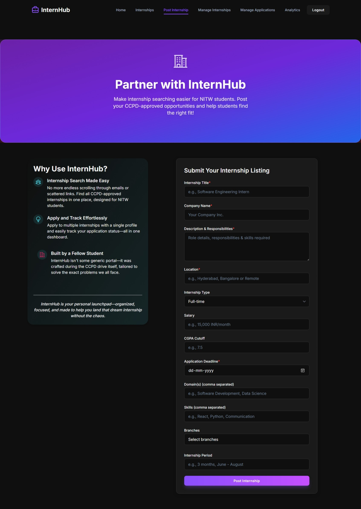

# InternHub

A full-stack internship management platform connecting NITW students with companies through role-based authentication and automated application tracking system.

## 🚀 Features

- **Role-based Access Control**: Separate interfaces for students and CCPD members
- **Advanced Filtering System**: Filter internships by domain, location, company, and CGPA requirements
- **Interactive Analytics Dashboard**: Real-time data visualization with charts and insights
- **Bulk Application Management**: Efficient processing of multiple applications simultaneously
- **Real-time Tracking**: Live monitoring of application status and platform growth
- **Responsive Design**: Modern UI with dark mode support and mobile optimization

## 📸 Screenshots

| [Landing Page](screenshots/LandingPage.jpeg) | [Internship Grid](screenshots/InternshipGrid.jpeg) | [Register Page](screenshots/RegisterPage.jpeg) |
|:---:|:---:|:---:|
|  |  |  |

| [Student Dashboard](screenshots/StudentDashboard.jpeg) | [View Internships Page](screenshots/ViewInternshipsPage.jpeg) | [Post Internship Page](screenshots/PostIntershipPage.jpeg) |
|:---:|:---:|:---:|
|  |  |  |

| [Analytics Dashboard](screenshots/AnalyticsDashboard.jpeg) | [Mobile View](screenshots/MobileView.jpeg) |
|:---:|:---:|
|  |  |

## 🛠️ Tech Stack

### Frontend
- **React 19** - Modern UI framework with hooks and context API
- **TailwindCSS** - Utility-first CSS framework for responsive design
- **Recharts** - Interactive data visualization library
- **React Router** - Client-side routing and navigation
- **Axios** - HTTP client for API communication

### Backend
- **Node.js** - JavaScript runtime environment
- **Express.js** - Web application framework
- **MongoDB** - NoSQL database with Mongoose ODM
- **JWT** - JSON Web Tokens for authentication
- **Multer** - File upload middleware
- **Helmet** - Security headers middleware

### Deployment
- **Docker** - Multi-stage containerization for optimized deployment
- **CORS** - Cross-origin resource sharing configuration

## 📊 Key Functionalities

### For Students
- Browse and filter internship opportunities
- Apply to multiple internships with one-click
- Track application status in real-time
- View personalized recommendations

### For CCPD Members
- Post new internship opportunities
- Manage applications with bulk operations
- Access comprehensive analytics dashboard
- Monitor platform growth and engagement

## 🏗️ Architecture

```
InternHub/
├── frontend/          # React application
│   ├── src/
│   │   ├── components/    # Reusable UI components
│   │   ├── pages/         # Page components
│   │   ├── contexts/      # React context for state management
│   │   ├── api/           # API integration
│   │   └── filters/       # Advanced filtering components
├── backend/           # Node.js API server
│   ├── controllers/   # Business logic handlers
│   ├── models/        # MongoDB schemas
│   ├── routes/        # API endpoints
│   ├── middleware/    # Authentication and validation
│   └── uploads/       # File storage
└── Dockerfile         # Multi-stage containerization
```

## 🚀 Quick Start

### Prerequisites
- Node.js (v18 or higher)
- MongoDB (local or Atlas)
- npm or yarn

### Installation

1. **Clone the repository**
```bash
git clone https://github.com/S1lentBanG/internhub.git
cd internhub
```

2. **Install dependencies**
```bash
# Install frontend dependencies
npm install

# Install backend dependencies
cd backend
npm install
```

3. **Environment Setup**
```bash
# Create .env file in backend directory
cd backend
cp .env.example .env
```

Edit your `.env` file with your MongoDB connection:
```
MONGO_URI=mongodb://localhost:27017/internhub
JWT_SECRET=your-secret-key-here
PORT=5000
```

### MongoDB Setup

**Option A: Local MongoDB**
1. Install [MongoDB Community Server](https://www.mongodb.com/try/download/community)
2. Start MongoDB service
3. Use connection string: `mongodb://localhost:27017/internhub`

**Option B: MongoDB Atlas (Recommended for Production)**
1. Create free account at [mongodb.com/atlas](https://mongodb.com/atlas)
2. Create a new cluster (free tier)
3. Click "Connect" → "Connect your application"
4. Copy the connection string and replace `<password>` with your database password
5. Update your `.env` file with the Atlas connection string

4. **Start the application**
```bash
# Start backend server
cd backend
npm start

# Start frontend development server (in new terminal)
npm run dev
```

5. **Access the application**
- Frontend: http://localhost:5173
- Backend API: http://localhost:5000

## 📱 Usage

### Student Registration
1. Visit the registration page
2. Select "NITW Student" role
3. Choose your engineering branch
4. Complete registration with NITW email

### CCPD Member Access
1. Register with "CCPD Member" role
2. Use verification code: `nitw-ccpd-2025`
3. Access analytics and management features

## 🔧 API Endpoints

### Authentication
- `POST /api/auth/register` - User registration
- `POST /api/auth/login` - User login
- `GET /api/auth/profile`